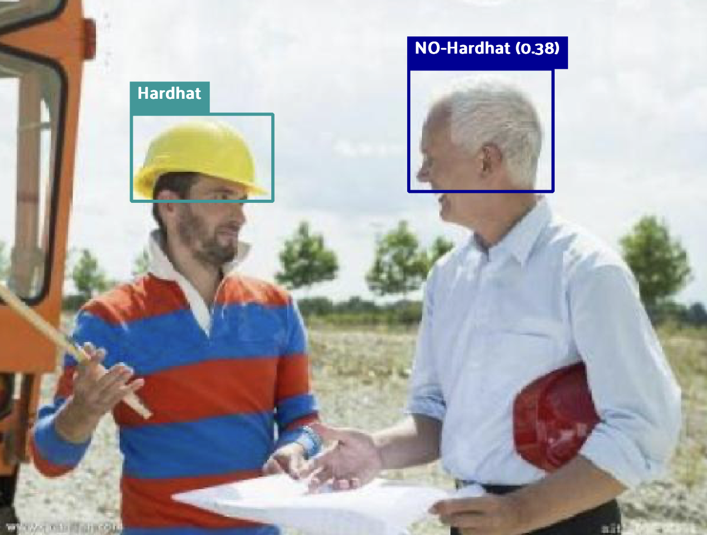

# Helmet Detection System

<p align="center">
  
</p>

An end-to-end computer vision pipeline for detecting safety helmet usage in construction environments using YOLOv8.

The project covers the full ML workflow including dataset preparation, model training, error analysis, and deployment via an inference API.

---

# Project Overview

This project implements a production-style ML pipeline for detecting whether workers are wearing safety helmets.

Key components include:

* Dataset preparation and annotation validation  
* Training YOLOv8 object detection models  
* Error analysis and dataset inspection using FiftyOne  
* Model performance benchmarking and experiment comparison  
* FastAPI inference service for real-time predictions

---

# System Architecture
```
Dataset (CSV Annotations)
        │
        ▼
Data Processing Pipeline
(CSV → YOLO format conversion)
        │
        ▼
Model Training (YOLOv8)
        │
        ▼
Error Analysis (FiftyOne)
        │
        ▼
Inference Module
        │
        ▼
FastAPI Serving Layer
```

---

# Repository Structure
```
api/            FastAPI inference service
configs/        Dataset / training configuration
data/           Dataset preparation utilities
runs/           Training/validation statistics and saved models
training/       Model training and evaluation
inference/      Prediction and benchmarking
examples/       Sample images for testing
scripts/        Data processing and analysis scripts
tests/          Unit tests
notebooks/      Exploratory analysis
```

---

# Dataset
Helmet detection dataset containing two classes:
```
Hardhat
NO-Hardhat
```
Dataset statistics:
- Images: ~19k
- Annotations: ~11k
- Classes: 2

Bounding box statistics:
```
Average bbox area: 0.023
Smallest bbox: 7e-06
Max objects per image: 112
```
This dataset contains many **small objects and partially occluded targets**, making detection more challenging.

---

# Model Training
Model: **YOLOv8n (Ultralytics)**

Training configuration in `configs/train_config.yml`:
```
image size: 512 / 768
epochs: 50
batch: 8
device: mps
```
Usage:
```
python training/train.py
```

---

# Training Results
|Model|Image Size|Hardhat Recall|NO-Hardhat Recall|
|---|---|---|---|
|YOLOv8n|512|0.89|0.83|
|YOLOv8n|768|0.91|0.87|
Increasing input resolution improved recall for **small and partially occluded objects**.

---

# Error Analysis
Model errors were analysed using **FiftyOne**.

Main failure modes:
* Small objects at long distances
* Partially occluded faces
* Side-view workers

Example error analysis workflow:
```
False Positive
False Negative
Class-specific recall
Bounding box size distribution
```
This analysis guided improvements such as increasing input resolution.

---

# Inference API
The project includes a FastAPI service for running helmet detection.

Start server:
```
uvicorn api.main:app --reload
```
API endpoint:
```
POST /detect
```
Example response:
```json
{
    "detections": [
        {
            "label": "Hardhat",
            "confidence": 0.93,
            "bbox": [x1, y1, x2, y2]
        }
    ]
}
```

--- 

# Running Tests

The project includes lightweight tests to validate the main pipeline components.

Test coverage includes:

* Dataset format validation  
* Model loading  
* Inference output format  

Run all tests with:
```
pytest tests/
```
Example output:
```
============================================ test session starts =============================================
platform darwin -- Python 3.10.19, pytest-9.0.2, pluggy-1.6.0
rootdir: /Users/kennyyu/cv-helmet-detection-system
configfile: pyproject.toml
plugins: anyio-4.12.1
collected 5 items                                                                                            

tests/test_data_pipeline.py ..                                                                         [ 40%]
tests/test_inference.py ..                                                                             [ 80%]
tests/test_training.py .                                                                               [100%]

============================================= 5 passed in 2.26s ==============================================
```
---

# Benchmark
Inference benchmark:

|Device|FPS|
|------|------|
|Apple M1 (MPS)|~8-10 FPS|

---

# Inference Performance

Device: Apple M1 (MPS)  
Model: YOLOv8n  
Image size: 768  

Latency: ~100ms per image  
Throughput: ~10 FPS

---

# Future Improvements
* Larger backbone models (YOLOv8s / YOLOv8m)
* Real-time video detection
* Deployment with Docker
* Model monitoring and drift detection

---

# Tech Stack
* Python
* PyTorch
* Ultralytics YOLOv8
* FiftyOne
* FastAPI
* OpenCV